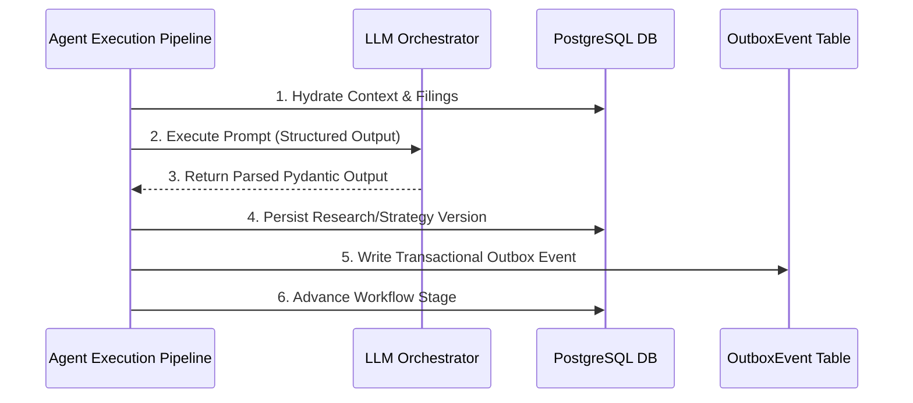

# InvestOps AI — AI Agents & Prompt Orchestration Architecture

Detailed specification of the AI Engineering layer in **InvestOps AI**, covering agent execution pipelines, prompt management, structured output parsing, LLM orchestrator fallbacks, and transactional outbox event publishing.

---

## 🤖 Agent Execution Pipeline (`apps/api/app/agents/pipeline.py`)

InvestOps AI encapsulates all AI agent execution inside `AgentExecutionPipeline`. The pipeline handles the complete execution lifecycle:

1. **Context Hydration**: Fetches workflow state, portfolio holdings, SEC EDGAR Form 10-K filing versions (`SourceDocumentVersion`), and market snapshots from PostgreSQL.
2. **LLM Orchestration**: Routes execution through `LLMOrchestrator`, supplying versioned prompt templates (`v1.0.0`) and enforcing Pydantic structured output models.
3. **Audit Logging**: Emits structured audit events (`AuditEvent`) recording model execution, token usage, latency, and outputs via `AuditService`.
4. **Transactional Outbox Event Publishing**: Writes domain events to the PostgreSQL `OutboxEvent` table in the same transaction to guarantee reliable event delivery.
5. **State Machine Transition**: Advances the workflow pipeline stage upon successful execution.



---

## 🔍 Agent Definitions

### 1. Market Intelligence Agent (`apps/api/app/agents/market_intelligence_agent.py`)
- **Stage**: Stage 1 (`MARKET_INTELLIGENCE`)
- **Prompt Template**: `MARKET_INTELLIGENCE_PROMPT_V1` ([prompts.py](file:///c:/Users/siddh/OneDrive/Desktop/coding%20projects/InvestOPs/apps/api/app/llm/prompts.py))
- **Structured Output Model**: `MarketIntelligenceOutput` ([schemas.py](file:///c:/Users/siddh/OneDrive/Desktop/coding%20projects/InvestOPs/apps/api/app/llm/schemas.py))
- **Functionality**:
  - Analyzes SEC EDGAR Form 10-K filings, quarterly earnings, and market snapshots.
  - Generates executive market summaries, top opportunities, and top risks.
  - Extracts empirical research claims (`ResearchClaimOutput`) with confidence scores.
  - Grounds every claim in verbatim excerpts and locator sections (`ClaimCitationOutput`) referencing persistent `SourceDocumentVersion` records.
  - Assigns per-company stock ratings (`OVERWEIGHT`, `NEUTRAL`, `UNDERWEIGHT`) and target prices.
- **Outbox Event Emitted**: `intelligence.report-completed.v1`

---

### 2. Portfolio Strategy Agent (`apps/api/app/agents/portfolio_strategy_agent.py`)
- **Stage**: Stage 2 (`PORTFOLIO_STRATEGY`)
- **Prompt Template**: `PORTFOLIO_STRATEGY_PROMPT_V1` ([prompts.py](file:///c:/Users/siddh/OneDrive/Desktop/coding%20projects/InvestOPs/apps/api/app/llm/prompts.py))
- **Structured Output Model**: `PortfolioStrategyOutput` ([schemas.py](file:///c:/Users/siddh/OneDrive/Desktop/coding%20projects/InvestOPs/apps/api/app/llm/schemas.py))
- **Functionality**:
  - Consumes research reports from Stage 1 and current portfolio holdings.
  - Calculates target asset weights, target share quantities, trade sides (`BUY`, `SELL`, `HOLD`), and individual trade rationales (`AllocationOutput`).
  - Computes annualized expected return, annualized volatility, diversification score, and investment horizon.
  - Generates a deterministic **SHA-256 Content Hash** (`artifact_hash`) by digesting the JSON payload of the recommendation version.
- **Outbox Event Emitted**: `strategy.recommendation-published.v1`

---

## 🧠 LLM Orchestrator & Fallback Engine (`apps/api/app/llm/orchestrator.py`)

`LLMOrchestrator` manages model invocation, token tracking (`total_tokens`), latency recording (`latency_ms`), and graceful fallback:

```python
class LLMOrchestrator:
    @classmethod
    def execute_market_intelligence(cls, ...):
        # 1. Attempt primary LLM call (Anthropic Claude 3.5 Sonnet / OpenAI GPT-4o)
        # 2. On network timeout or mock mode, execute deterministic structured output generator
        # 3. Validate response against MarketIntelligenceOutput Pydantic schema
        # 4. Return validated result with token usage metadata
```

---

## 🛡️ Agent Safety & Boundary Invariants

1. **Read-Only Context Operations**: Agents are strictly read-only observers of market filings and portfolio holdings.
2. **Zero Execution Credentials**: Agent runtime containers do NOT possess API keys, private keys, or FIX credentials for broker endpoints.
3. **Mandatory Human Verification Gate**: Model outputs (recommendation versions) must pass pre-trade mandate validation and receive a human `APPROVE` decision before trade orders can be generated.
