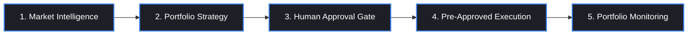

# InvestOps AI — Institutional Investment Control Plane

> AI-assisted, human-in-the-loop portfolio management platform with deterministic workflow state machine enforcement, pre-trade mandate validation, and immutable auditability.

[](https://github.com/sidlawliet/onyx/actions/workflows/ci.yml)
[](#license)
[](https://www.python.org/)
[](https://nextjs.org/)

---

## 🏛️ Executive Overview

**InvestOps AI** is an institutional-grade investment management control plane designed for asset managers, hedge funds, and investment committees. It bridges generative AI capability with strict institutional governance by enforcing a fixed, non-bypassable 5-stage workflow state machine:



---

## 🔒 Core Invariants & Safety Principles

1. **Substantive Human Investment Authority**: Generative agents prepare equity research, extract Form 10-K claims, and calculate target asset allocations; they **never** possess authority to approve allocations or release broker trades.
2. **Deterministic Execution Safety Gate**: Execution endpoints reject free-form trade orders. Orders must reference a locked `ArtifactManifest` with a valid, active `APPROVE` decision, revalidating the exact SHA-256 content hash prior to release.
3. **Immutable Auditability**: All material decisions, model outputs, human attestations, and FIX broker fills are recorded in an immutable SHA-256 hash-chained audit log (`AuditEvent`).
4. **Idempotency Enforcement**: Multi-channel broker execution requests require unique client-supplied idempotency keys (`idempotency_key`), preventing duplicate trade execution.
5. **Strict Tenant & Role Isolation**: Database rows enforce single/multi-tenant row-level security (`tenant_id`), supported by Role-Based Access Control (RBAC) covering `ANALYST`, `APPROVER`, `TRADER`, and `AUDITOR`.

---

## 🛠️ Technology Stack

| Layer | Technology |
| :--- | :--- |
| **Frontend Web** | Next.js 14 (App Router), React 18, Tailwind CSS, Axios, Material Symbols |
| **Backend API** | FastAPI (Python 3.11+), Pydantic v2, Uvicorn, Gunicorn |
| **Database & ORM** | PostgreSQL 16, SQLAlchemy 2.0, Alembic Migrations |
| **AI Orchestration** | Anthropic Claude 3.5 Sonnet / OpenAI GPT-4o, Pydantic Structured Outputs |
| **Testing** | Pytest, Playwright E2E, AnyIO, Starlette TestClient |
| **DevOps & Infrastructure** | Docker Multi-Stage, Docker Compose, GitHub Actions, Railway, Vercel |

---

## 🚀 Quick Start (Local Setup)

### Prerequisites
- **Python 3.11+**
- **Node.js 20+** & `npm`
- **Git**

### 1. Clone & Configure
```bash
git clone https://github.com/sidlawliet/onyx.git
cd onyx
cp .env.example .env
```

### 2. Set Up Backend API (`apps/api`)
```bash
# Create and activate virtual environment
python -m venv .venv
source .venv/bin/activate  # On Windows: .venv\Scripts\activate

# Install backend package and dependencies
pip install -e . pytest anyio httpx

# Run single-tenant demo seed data script (SQLite offline / PostgreSQL)
python -m apps.api.app.db.seed

# Start FastAPI dev server on port 8000
python -m uvicorn apps.api.app.main:app --reload --port 8000
```

### 3. Set Up Frontend Web (`apps/web`)
```bash
# Navigate to web application directory
cd apps/web

# Install dependencies
npm install

# Start Next.js development server on port 3000
npm run dev
```

Visit **[http://localhost:3000](http://localhost:3000)** in your browser. Authenticate using demo persona:
- **Approver**: `approver@investops.ai`
- **Analyst**: `analyst@investops.ai`
- **Trader**: `trader@investops.ai`

---

## 🧪 Testing Suite

### Run Backend Pytest Unit & Integration Tests
```bash
python -m pytest -v
```

### Run Frontend Next.js Production Build
```bash
cd apps/web
npm run build
```

### Run Playwright E2E Browser Tests
```bash
cd apps/web
npx playwright test
```

---

## 📚 Project Documentation

- **[DEPLOYMENT.md](DEPLOYMENT.md)** — Docker multi-stage builds, Docker Compose, Railway backend & Vercel frontend deployment guide.
- **[API_DOCUMENTATION.md](API_DOCUMENTATION.md)** — Complete REST API reference, JWT auth headers, request/response schemas, and error codes.
- **[AGENTS_AND_SKILLS.md](AGENTS_AND_SKILLS.md)** — Architecture of Market Intelligence Agent, Portfolio Strategy Agent, LLM Orchestrator, and Outbox Event Publishing.
- **[CONTRIBUTING.md](CONTRIBUTING.md)** — Developer contribution guidelines, commit formatting, and PR submission rules.

---

## 📄 License

Proprietary Institutional Platform. All rights reserved.
